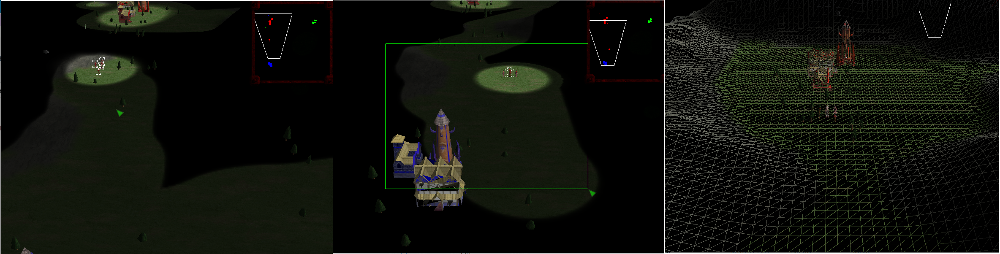
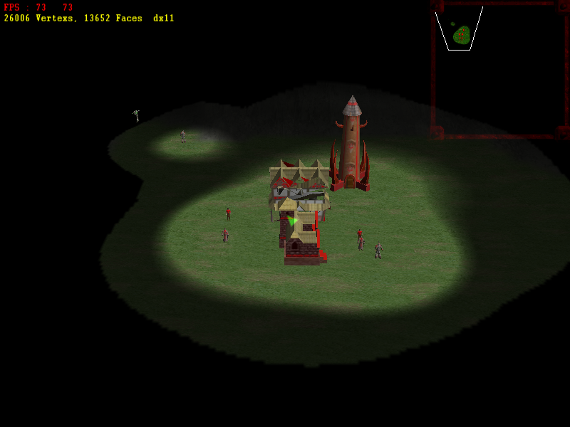
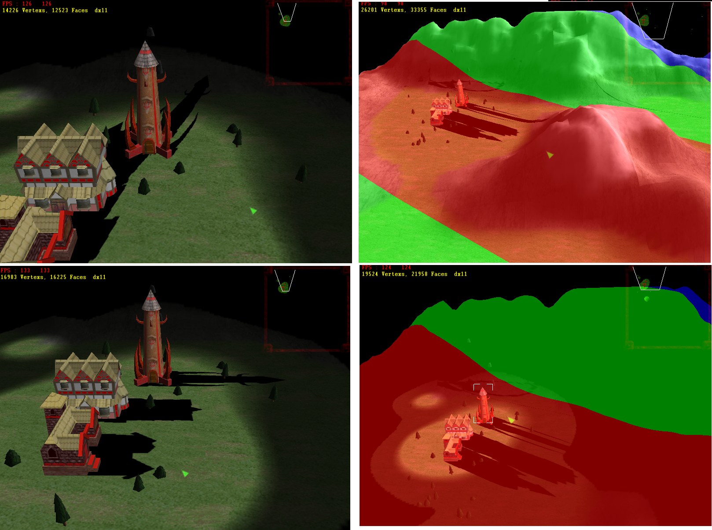
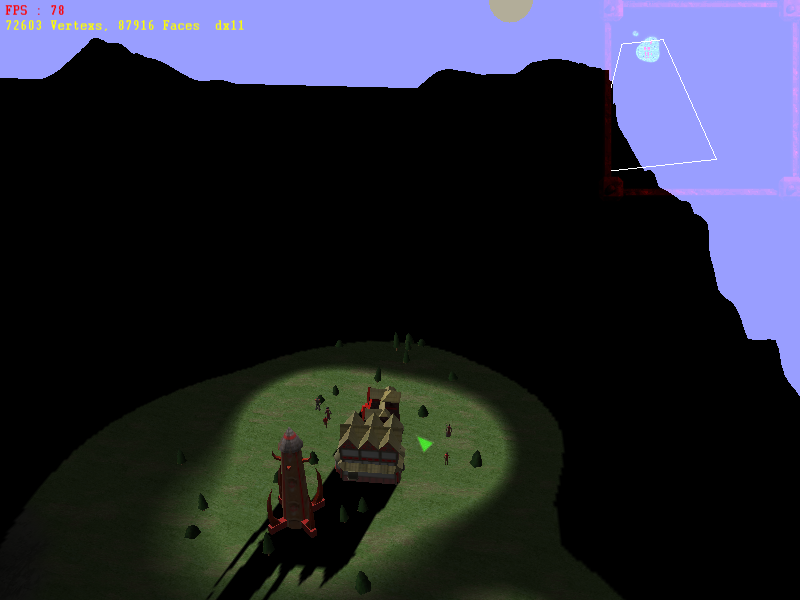

# RealTimeStrategy-
祝大家兔年吉祥，前兔似锦，大展宏兔，happy new year!

受到Epic的热烈影响，我们也要造轮子，我们决定从零开始写一个RealTimeStrategy游戏引擎，i like coding纯属娱乐。

一features

1根据heightmap自动生成地图，自动添加地图物品；地图支持草地，雪地，山地多种地形；支持敌我视图控制以及战争迷雾视野。

2魔兽争霸3风格镜头控制，自由移动，拖动，缩放，小地图显示控制。

3支持模型蒙皮骨骼动画显示。

4物体支持自动寻路，敌对交战只能平a。

5支持directx11

6多线程渲染，按材质分类渲染

7阴影支持，阴影可随时间变化

8天空出现了，太阳出来了，夜晚也就很快了

二in planning

1完善RealTimeStrateg游戏操作显示风格，包括天空，大气散射，昼夜显示，chaos等。

2人机对战智能设计。

3编辑器。

